# Capo Authentication Flow Diagrams

**Date:** 2025-01-20  
**Current Implementation:** Phase 6.6 (with phone pre-check + universal entry point)

---

## Overview: All Authentication Paths


**Key Distinction:**
- **Purple** (/open): Smart router - notification emails, bookmarks, multi-device
- **Green** (/join): Onboarding flow - invite links for new members
- **Tan** (/auth/login): Direct login - existing players
- **Blue** (Admin signup): Platform-level club creation

---

## Flow 0: Universal Entry Point (`/open?club=SLUG`) - Smart Routing ✅

**Status:** ✅ Implemented (January 20, 2025)

**Purpose:** Universal "Open Capo" link that works on any device. Checks authentication state and routes accordingly.

**Use Cases:**
- Approval notification emails
- Match reminder emails  
- Bookmarked links
- Multi-device access
- Future: Universal link for mobile app

```mermaid
graph TD
    Start([User Clicks Link<br/>/open?club=SLUG]) --> CheckAuth{User Authenticated<br/>on This Device?}
    
    CheckAuth -->|YES - Has Session| ValidateAccess{Has Access<br/>to This Club?}
    CheckAuth -->|NO - No Session| RedirectLogin[Redirect to<br/>/auth/login?returnUrl=/open?club=SLUG]
    
    ValidateAccess -->|YES| CheckRole{What Role?}
    ValidateAccess -->|NO - Wrong Club| ErrorWrongClub[Show Error:<br/>Wrong Club]
    
    CheckRole -->|Admin| AdminDash[/admin/matches]
    CheckRole -->|Player| PlayerDash[/player/dashboard]
    
    RedirectLogin --> PhoneLogin[Phone + SMS Login]
    PhoneLogin --> Success{Login Success?}
    Success -->|YES| ReturnToOpen[Return to /open?club=SLUG]
    Success -->|NO| LoginError[Show Login Error]
    
    ReturnToOpen --> CheckRole
    
    style CheckAuth fill:#DDA0DD
    style CheckRole fill:#90EE90
    style AdminDash fill:#FFE4B5
    style PlayerDash fill:#87CEEB
```

**Mental Model:**
- **Phone number = Authentication** (your key to Capo)
- **Email = Notification + Deep Link** (tells you something + takes you there)
- **Email is NOT authentication** (just a shortcut)

**Key Benefits:**
1. **Same Device:** Instant redirect if already logged in
2. **New Device:** Clear UX - "We'll text you once to verify"
3. **Multi-Device:** Each device has independent session
4. **Future-Proof:** Ready for mobile app universal links

**Email Copy:**
```
Subject: You've been approved for [Club Name] 🎉

You're all set! Your account has been approved.

[Button: Open Capo]
Link: /open?club=SLUG

On this device: If you're already logged in, we'll take you straight to your club.
On a new device: We'll text your phone a quick verification code the first time.
```

**vs. Invite Links:**
- `/join/[tenant]/[token]` = Onboarding (new players joining club)
- `/open?club=SLUG` = Access (approved players opening app)

---

## Flow 1: Direct Login (`/auth/login`) - With Pre-Check ✅

**Status:** ✅ Implemented (Phase 6.6 - Final Architecture)

```mermaid
graph TD
    Start([User at /auth/login]) --> EnterPhone[Enter Phone Number]
    
    EnterPhone --> ClientValidate{Client-Side Validation}
    ClientValidate -->|Invalid Format| ValidationError[Show Error: Invalid UK Number]
    ValidationError --> EnterPhone
    
    ClientValidate -->|Valid Format| PreCheck[Call /api/auth/check-phone]
    
    PreCheck --> RateLimit{Rate Limit OK?}
    RateLimit -->|No - 11th request| RateLimited[429 Error: Too Many Requests]
    RateLimited --> Wait[Wait 1 Minute]
    Wait --> EnterPhone
    
    RateLimit -->|Yes| SearchDB{Phone in<br/>Any Tenant?}
    
    SearchDB -->|FOUND or NOT FOUND| SendSMS[Always Send SMS OTP<br/>Bot Protection via Rate Limit]
    SendSMS --> EnterOTP[Enter OTP Code]
    EnterOTP --> VerifyOTP{OTP Valid?}
    VerifyOTP -->|No| WrongOTP[Error: Invalid Code]
    WrongOTP --> EnterOTP
    
    VerifyOTP -->|Yes| CheckPreCheckResult{Was Phone<br/>in Database?}
    
    CheckPreCheckResult -->|FOUND - Existing Player| LinkByPhone[Call /api/auth/link-by-phone]
    LinkByPhone --> CheckRole{Is Admin?}
    CheckRole -->|Yes| AdminDash[Redirect to /admin/matches]
    CheckRole -->|No| PlayerDash[Redirect to / dashboard]
    
    CheckPreCheckResult -->|NOT FOUND - New Player| ShowJoinForm[Show Join Form:<br/>Club Code + Name + Email]
    ShowJoinForm --> FillForm[Phone: Verified ✓<br/>Club Code: _____<br/>Name: _____<br/>Email: _____ optional]
    FillForm --> SubmitRequest[Submit to /api/join/request-access]
    SubmitRequest --> ValidateCode{Club Code<br/>Valid?}
    ValidateCode -->|No| CodeError[Error: Club Not Found]
    CodeError --> FillForm
    ValidateCode -->|Yes| CreateRequest[Create player_join_requests<br/>WITH auth_user_id]
    CreateRequest --> PendingApproval[Redirect to /auth/pending-approval]
    PendingApproval --> AdminApproves[Admin Approves]
    AdminApproves --> SendEmail[📧 Email with /open Link]
    SendEmail --> EmailReceived[Player Gets Email<br/>on Any Device]
    EmailReceived --> ClickOpen[Clicks: Open Capo]
    ClickOpen --> OpenRoute[/open?club=SLUG]
    OpenRoute --> CheckSession{Logged In<br/>on This Device?}
    CheckSession -->|YES| Dashboard[Dashboard + App Promo Modal]
    CheckSession -->|NO| PhoneLogin[Phone + SMS]
    PhoneLogin --> Dashboard
    
    PreCheck -->|API Failed| Fallback[Lenient Fallback: Continue with SMS]
    Fallback --> SendSMS
    
    style SearchDB fill:#FFB6C1
    style ShowClubCode fill:#FFE4B5
    style SendSMS fill:#90EE90
    style RedirectInvite fill:#FFD700
```

**Key Points:**
- ✅ Pre-check prevents SMS waste (NOT FOUND path)
- ✅ Rate limiting prevents bot attacks
- ✅ Client validation saves DB calls
- ✅ Lenient fallback (if pre-check fails, proceed with SMS)
- ⚠️ Club code redirects to invite flow (may show QR on desktop - UX issue)

---

## Flow 2: Invite Link Flow (`/join/[tenant]/[token]`) - Primary Onboarding

**Status:** ✅ Implemented (Phase 6)

```mermaid
graph TD
    Start([User Clicks Invite Link]) --> ValidateToken[Validate Invite Token]
    
    ValidateToken --> TokenValid{Token Valid?}
    TokenValid -->|No| InvalidToken[Show: Invalid Link]
    InvalidToken --> BackToLogin[Try Regular Login Button]
    
    TokenValid -->|Yes| DetectPlatform{Platform?}
    
    DetectPlatform -->|Desktop| QRCode[Show QR Code + URL]
    QRCode --> StuckDesktop[🐛 NO CONTINUE BUTTON]
    StuckDesktop -->|User Confused| End1([Flow Ends - UX Bug])
    
    DetectPlatform -->|Mobile Web| AppPrompt[Show: Download App CTA]
    AppPrompt --> UserChoice{User Clicks?}
    UserChoice -->|Download App| PlayStore[Redirect to Play Store]
    UserChoice -->|Continue on Web| PhoneEntry[Enter Phone Number]
    
    DetectPlatform -->|Capacitor App| PhoneEntry
    
    PhoneEntry --> SendOTP[Send SMS OTP]
    SendOTP --> EnterOTP[Enter OTP Code]
    EnterOTP --> VerifyOTP{OTP Valid?}
    VerifyOTP -->|No| OTPError[Error: Invalid Code]
    OTPError --> EnterOTP
    
    VerifyOTP -->|Yes| EnterName[Enter Name + Optional Email]
    EnterName --> Submit[Submit to /api/join/link-player]
    
    Submit --> CheckPhone{Phone Matches<br/>Existing Player?}
    
    CheckPhone -->|YES - Auto-Link| LinkExisting[Link auth_user_id to Player]
    LinkExisting --> Dashboard[Redirect to Dashboard ✅]
    
    CheckPhone -->|NO - New Player| CreateRequest[Create player_join_requests Record]
    CreateRequest --> PendingPage[Redirect to /auth/pending-approval]
    
    PendingPage --> Poll[Poll Every 5 Seconds]
    Poll --> CheckApproval{Admin Approved?}
    CheckApproval -->|Not Yet| Poll
    CheckApproval -->|Yes| CreatePlayer[Create Player Record]
    CreatePlayer --> Dashboard
    
    style QRCode fill:#FFB6C1
    style StuckDesktop fill:#FF6B6B
    style PhoneEntry fill:#90EE90
    style CreateRequest fill:#FFE4B5
    style Dashboard fill:#87CEEB
```



**Key Points:**
- ✅ Desktop shows QR code (by design, for app download)
- 🐛 Desktop has NO "continue" button (UX bug)
- ✅ Mobile has "Continue on web →" link (works)
- ✅ Auto-links if phone matches existing player (no approval needed)
- ✅ Creates join request if phone is new (admin approval required)
- ⚠️ Passive polling (no push notifications)

---

## Flow 3: Club Code from Login (FIXED ✅)

**Status:** ✅ Fixed (Phase 6.6) - Seamless flow to join form

```mermaid
graph TD
    Start([User at /auth/login<br/>Phone NOT in DB]) --> PreCheckFail[Pre-Check: NOT FOUND]
    PreCheckFail --> ShowCode[Show Club Code Entry]
    ShowCode --> EnterCode[User Enters: F8C65]
    EnterCode --> LookupCode[Call /api/join/by-code]
    
    LookupCode --> GetURL[Returns: /join/berko-tnf/token]
    GetURL --> Redirect[router.push to Invite URL]
    
    Redirect --> SkipLanding[✅ FIXED: Skip Landing on Web]
    SkipLanding --> PhoneEntry[Go Straight to Phone Entry]
    PhoneEntry --> OTP[Get OTP]
    OTP --> Name[Enter Name + Email]
    Name --> JoinRequest[Create Join Request with Email]
    JoinRequest --> Pending[/auth/pending-approval]
    Pending --> Poll[Poll Every 5s + Wait for Email]
    Poll --> AdminApproves[Admin Approves]
    AdminApproves --> SendEmail[📧 Email with /open Link]
    SendEmail --> EmailClick[Player Clicks Email]
    EmailClick --> OpenFlow[→ /open Flow]
    OpenFlow --> Dashboard[Dashboard Access]
    
    style SkipLanding fill:#90EE90
    style JoinRequest fill:#90EE90
    style SendEmail fill:#90EE90
    style Dashboard fill:#87CEEB
```

**Fixed Issues (Phase 6.6):**
- ✅ **Desktop:** Now skips landing, goes straight to phone entry
- ✅ **Mobile:** Skips app prompt, enters phone once only
- ✅ **Both:** No more out-of-context marketing pages
- ✅ **Email:** Approval notifications sent (if email provided + Resend configured)

---

## Flow 4: No-Club Page (`/auth/no-club`) - Edge Case

**Status:** ✅ Working (rarely used now with pre-check)

```mermaid
graph TD
    Start([User Already Authenticated<br/>But Phone NOT in DB]) --> NoClubPage[/auth/no-club Page]
    
    NoClubPage --> ShowMessage[Shows: We couldn't find your club]
    ShowMessage --> EnterCode[Enter Club Code: F8C65]
    EnterCode --> LookupCode[Call /api/join/by-code]
    
    LookupCode --> CodeValid{Valid?}
    CodeValid -->|No| Error[Error: Club Not Found]
    Error --> EnterCode
    
    CodeValid -->|Yes| RedirectInvite[Redirect to /join/tenant/token]
    RedirectInvite --> SameIssue[🐛 Same UX Issue as Flow 3]
    SameIssue --> QRorAppPrompt[QR Code or App Download]
    
    style NoClubPage fill:#FFE4B5
    style SameIssue fill:#FFB6C1
```

**Note:** This page is reached after OTP verification, so user IS authenticated. Still has same redirect issue as Flow 3.

---

## Flow 5: Admin Signup (`/signup/admin`) - Club Creation

**Status:** ✅ Working

```mermaid
graph TD
    Start([User at /signup/admin]) --> CheckSession[Check Existing Session]
    
    CheckSession --> HasSession{Already<br/>Authenticated?}
    HasSession -->|Yes, Has Player| Error[Error: Already Member<br/>Force Logout → /auth/login]
    HasSession -->|Yes, No Player| Logout[Sign Out + Clear Storage]
    Logout --> Continue
    HasSession -->|No| Continue[Continue to Signup]
    
    Continue --> DetectPlatform{Platform?}
    
    DetectPlatform -->|Mobile Web| ShowAppPrompt[Show: Download App First]
    ShowAppPrompt --> UserChoice{User Choice?}
    UserChoice -->|Download| PlayStore[→ Play Store]
    UserChoice -->|Continue Web| PhoneStep
    
    DetectPlatform -->|Desktop| PhoneStep[Step 1: Enter Phone]
    
    PhoneStep --> SendOTP[Send SMS OTP]
    SendOTP --> EnterOTP[Step 2: Enter OTP]
    EnterOTP --> VerifyOTP{Valid?}
    VerifyOTP -->|No| OTPError[Error]
    OTPError --> EnterOTP
    
    VerifyOTP -->|Yes| DetailsStep[Step 3: Enter Details]
    DetailsStep --> EnterDetails[Email + Name + Club Name]
    EnterDetails --> Submit[Call /api/admin/create-club]
    
    Submit --> CreateTransaction[Create Tenant + Player<br/>Generate Club Code<br/>Set is_admin=true]
    CreateTransaction --> Success[Redirect to /admin/matches]
    
    style PhoneStep fill:#90EE90
    style CreateTransaction fill:#87CEEB
    style Success fill:#87CEEB
```



**Key Points:**
- ✅ Forces logout if already authenticated
- ✅ 3-step process (phone → OTP → details)
- ✅ Creates tenant + first admin player
- ✅ Auto-generates club code (e.g., F8C65)

---

## Flow 6: Pending Approval + Email Notification ✅

**Status:** ✅ Updated (January 20, 2025) - Now includes email notification

```mermaid
graph TD
    Start([User Submitted Join Request]) --> PendingPage[/auth/pending-approval]
    
    PendingPage --> ShowMessage[Shows: Almost There!<br/>Pending Admin Approval]
    ShowMessage --> TwoTracks{User has two ways<br/>to know approval:}
    
    TwoTracks -->|Track 1: Active Polling| StartPolling[Poll Every 5 Seconds]
    TwoTracks -->|Track 2: Email Notification| WaitForEmail[📧 Wait for Email]
    
    StartPolling --> Wait[Wait 5 Seconds]
    Wait --> CheckAPI[Call /api/auth/profile]
    CheckAPI --> HasPlayer{linkedPlayerId<br/>Exists?}
    HasPlayer -->|No| Wait
    HasPlayer -->|Yes| Approved[Admin Approved! ✅]
    Approved --> Dashboard[Redirect to Dashboard]
    
    WaitForEmail --> AdminApproves[Admin Clicks Approve]
    AdminApproves --> SendEmail[📧 Send Email with /open Link]
    SendEmail --> PlayerGetsEmail[Player Opens Email<br/>on Any Device]
    PlayerGetsEmail --> ClickOpen[Clicks: Open Capo]
    ClickOpen --> OpenRoute[/open?club=SLUG]
    OpenRoute --> SessionCheck{Already Logged In<br/>on This Device?}
    SessionCheck -->|YES| Dashboard
    SessionCheck -->|NO| PhoneLogin[Phone + SMS Login]
    PhoneLogin --> Dashboard
    
    PendingPage --> UserAction[User Can: Try Different Number]
    UserAction --> Logout[Sign Out]
    Logout --> BackToLogin[→ /auth/login]
    
    style PendingPage fill:#FFE4B5
    style SendEmail fill:#DDA0DD
    style OpenRoute fill:#DDA0DD
    style Approved fill:#90EE90
    style Dashboard fill:#87CEEB
```

**Multi-Device Support:**
- ✅ **Same Device (Polling):** User keeps page open → Auto-redirects on approval
- ✅ **Different Device (Email):** User clicks email link → Phone verification → Dashboard
- ✅ **Multiple Sessions:** Each device has independent session (all valid simultaneously)

**Email Mental Model:**
- **Phone = Authentication** (proves who you are)
- **Email = Notification** (tells you when approved + gives shortcut)
- **NOT:** Email as authentication method

---

## The Problem: Club Code → Invite Link UX Bug

```mermaid
graph TD
    Start([Club Code Entry from /auth/login]) --> Context1[User Context:<br/>• On web already<br/>• Engaged in auth flow<br/>• Wants to continue on THIS device]
    
    Context1 --> EnterCode[Enter Club Code: F8C65]
    EnterCode --> LookupAPI[POST /api/join/by-code]
    LookupAPI --> GetInviteURL[Returns: /join/berko-tnf/token]
    
    GetInviteURL --> Redirect[router.push to Invite URL]
    
    Redirect --> InvitePage[/join/berko-tnf/token Loads]
    InvitePage --> DetectPlatform{Platform?}
    
    DetectPlatform -->|Desktop| QRScreen[🐛 Shows QR Code<br/>'Scan with your phone']
    QRScreen --> NoButton[🐛 NO Continue Button]
    NoButton --> UserStuck[User Stuck:<br/>• Already on device they want<br/>• QR is out of context<br/>• No way forward]
    UserStuck --> End1([Flow Broken ❌])
    
    DetectPlatform -->|Mobile Web| AppDownload[Shows: Download App CTA]
    AppDownload --> ContinueLink[Has 'Continue on web →' Link ✅]
    ContinueLink --> PhoneAgain[🐛 Enter Phone AGAIN]
    PhoneAgain --> Annoying[Annoying UX:<br/>Just gave phone in previous screen!]
    Annoying --> OTP[Get OTP]
    OTP --> Name[Enter Name]
    Name --> JoinRequest[Create Join Request]
    JoinRequest --> Pending[/auth/pending-approval ✅]
    
    style QRScreen fill:#FF6B6B
    style UserStuck fill:#FF6B6B
    style PhoneAgain fill:#FFB6C1
    style Annoying fill:#FFB6C1
    style Pending fill:#87CEEB
```

**Root Cause:** Invite link page is designed for **marketing/app-download**, not for **mid-auth-flow redirects**.

---

## Solution Options

### Option A: Add Continue Button to Desktop QR View (Quick Fix)


**Pros:** Simple 5-line fix  
**Cons:** Still shows QR unnecessarily, still asks for phone twice

---

### Option B: Skip Landing Entirely for Club Code Users (Better UX)

```mermaid
graph TD
    ClubCode[User Enters Club Code] --> Lookup[/api/join/by-code]
    Lookup --> Return[Returns join_url + query param:<br/>/join/tenant/token?skipLanding=true]
    Return --> InvitePage[Invite Page Detects Param]
    InvitePage --> SkipToPhone[Skip Landing<br/>Go Straight to Phone Entry]
    SkipToPhone --> RestOfFlow[Phone → OTP → Name → Join Request]
    
    style SkipToPhone fill:#90EE90
```

**Pros:** Best UX, no confusion  
**Cons:** Requires 2 file changes (login page + invite page)

---

### Option C: Skip Landing on ALL Web Visits (Simplest)

```mermaid
graph TD
    InvitePage[/join/tenant/token] --> DetectCapacitor{In Capacitor App?}
    DetectCapacitor -->|Yes| ShowLanding[Show App Benefits Landing]
    DetectCapacitor -->|No - Web Browser| SkipToPhone[Skip Landing<br/>Go Straight to Phone Entry]
    
    ShowLanding --> PhoneEntry
    SkipToPhone --> PhoneEntry[Phone → OTP → Name]
    
    style SkipToPhone fill:#90EE90
```

**Pros:** Fixes both club code AND direct invite links on web  
**Cons:** Loses app marketing for web users (acceptable - they're already on web!)

---

## Current State Summary

```mermaid
graph LR
    subgraph "Working Flows ✅"
        A1[Direct Login<br/>Existing Player]
        A2[Admin Signup]
        A3[Invite Link Mobile]
    end
    
    subgraph "Fixed in Phase 6.6 ✅"
        B1[Club Code → Desktop<br/>Skips to Phone Entry]
        B2[Club Code → Mobile<br/>Skips to Phone Entry]
        B3[Invite Link Desktop<br/>Skips to Phone Entry]
    end
    
    subgraph "Edge Cases ✅"
        C1[No-Club Page<br/>Club Code Entry]
        C2[Pending Approval<br/>Passive Polling]
    end
    
    style B1 fill:#90EE90
    style B2 fill:#90EE90
    style B3 fill:#90EE90
    style A1 fill:#90EE90
    style A2 fill:#90EE90
    style A3 fill:#90EE90
```



---

## Recommended Fix: Option C (Skip Landing on Web)

**Change:** `src/app/join/[tenant]/[token]/page.tsx`

```typescript
// Current code (line 37-47):
useEffect(() => {
  const checkMobile = /Android|iPhone|iPad|iPod/i.test(navigator.userAgent);
  setIsMobile(checkMobile);
  
  // If already in Capacitor app, skip landing and go straight to phone verification
  const isCapacitor = document.documentElement.classList.contains('capacitor');
  if (isCapacitor && !validatingToken && clubName) {
    setStep('phone');
  }
}, [validatingToken, clubName]);

// CHANGE TO:
useEffect(() => {
  const checkMobile = /Android|iPhone|iPad|iPod/i.test(navigator.userAgent);
  setIsMobile(checkMobile);
  
  // Skip landing page if NOT in Capacitor app (web browser - desktop or mobile)
  const isCapacitor = document.documentElement.classList.contains('capacitor');
  if (!isCapacitor && !validatingToken && clubName) {
    setStep('phone'); // Skip landing on ALL web (desktop + mobile web)
  }
}, [validatingToken, clubName]);
```

**Result:**
- ✅ Desktop: Skips QR, goes straight to phone entry
- ✅ Mobile Web: Skips app download, goes straight to phone entry
- ✅ Capacitor App: Still shows landing (app benefits)
- ✅ Fixes club code UX bug
- ✅ Also fixes direct invite link UX on desktop!

**Trade-off:** Lose app marketing for web users (acceptable - they're already on web and chose not to use app)

---

**Want me to implement Option C?** It's a 1-line change that fixes the UX bug for everyone! 🚀

---

## Architecture Decision: Route Separation (January 20, 2025)

### Clean Separation of Concerns

**Key Insight:** Email is notification, not authentication.

| Route | Purpose | Auth Method | Audience |
|-------|---------|-------------|----------|
| `/open?club=SLUG` | Access club | Phone + SMS (if needed) | Approved members |
| `/join/[tenant]/[token]` | Onboarding | Phone + SMS | New members |
| `/auth/login` | Direct login | Phone + SMS | Existing players |

### Mental Model for Users

**Phone Number = Your Key to Capo**
- Phone + SMS is how you authenticate
- Works on any device (creates new session)
- Required once per device

**Email = Notification + Shortcut**
- Tells you when something happened
- Gives you quick link to open app
- NOT an authentication method

**The /open Route**
- Universal entry point
- Smart: checks if you're logged in
- If yes → dashboard immediately
- If no → phone login → then dashboard
- Works for: emails, bookmarks, deep links, universal links

### Why This is Better Than Magic Links

**Magic Links Would:**
- ❌ Make email a second auth factor (confusing)
- ❌ Weaken security (email compromise = account takeover)
- ❌ Clash with "phone is your key" mental model
- ❌ Add complexity (token generation, expiry, revocation)

**Current /open Route:**
- ✅ Keeps phone as single auth factor (clear)
- ✅ Strong security (requires SMS on new devices)
- ✅ Consistent mental model
- ✅ Simple architecture (no new systems)

### Multi-Device Support

**Supabase Sessions:**
- Each device gets independent session
- Multiple sessions active simultaneously
- Example:
  - Phone: Session 1 (from invite link)
  - Laptop: Session 2 (from email click)
  - Tablet: Session 3 (from bookmark)
  - **All valid at once** ✅

**Why SMS on New Device is Good:**
- ✅ Verifies user has phone access
- ✅ Prevents account takeover
- ✅ Creates secure session
- ✅ Only happens once per device

### Future: Mobile App Universal Links

When Capacitor app ships:

**Universal Link:** `https://capo.app/open?club=SLUG`
- If app installed → Opens app, routes internally
- If not installed → Opens web browser
- Same URL works everywhere (no platform detection needed)

**Email stays the same:**
```
[Button: Open Capo]
Link: /open?club=SLUG
```

**User experience:**
- Has app: Opens in app (seamless)
- No app: Opens in browser (works fine)
- Email template never changes

---

