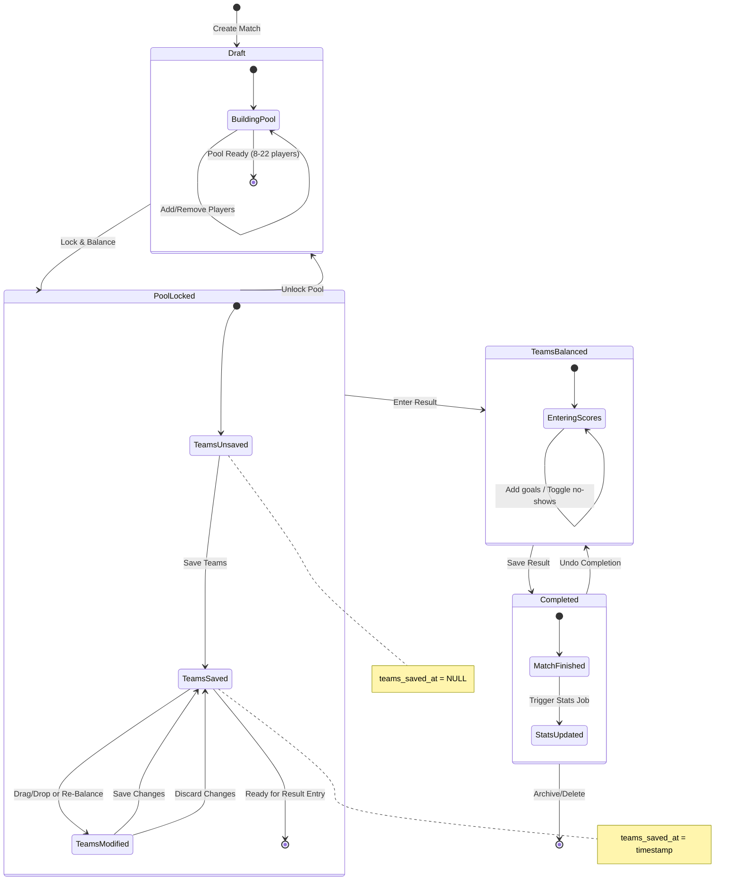
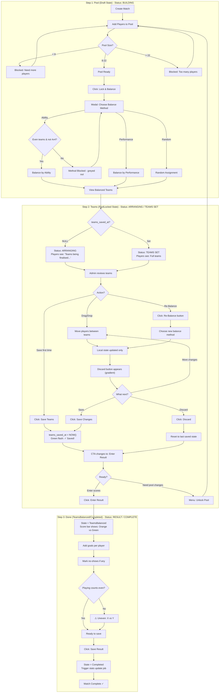
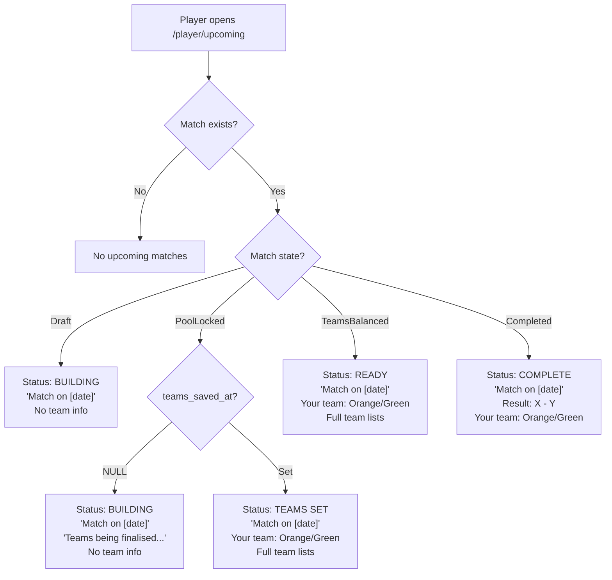
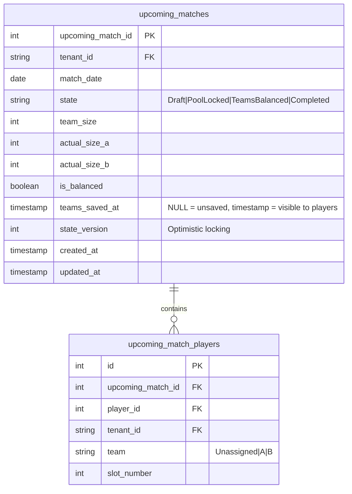
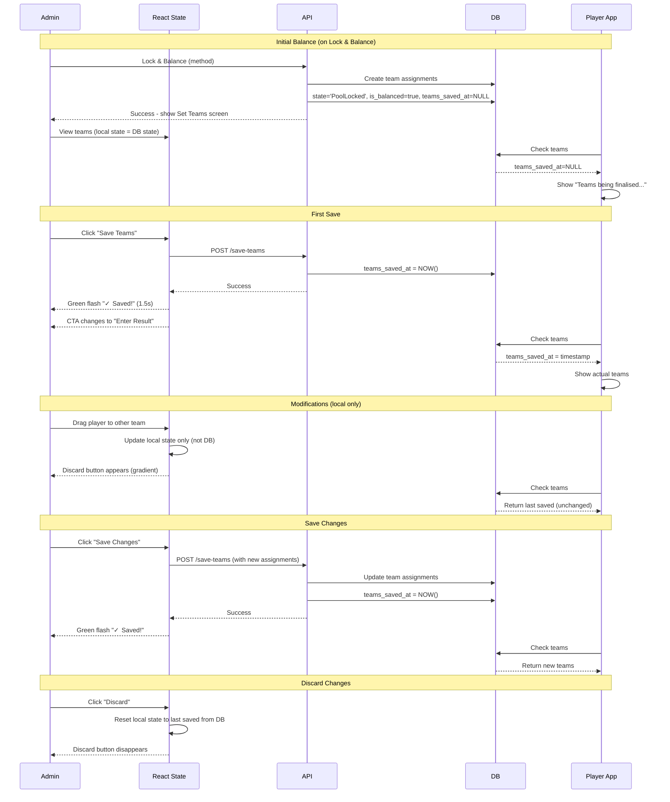
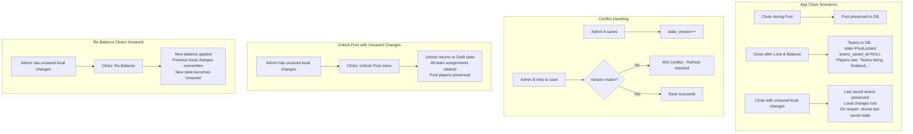
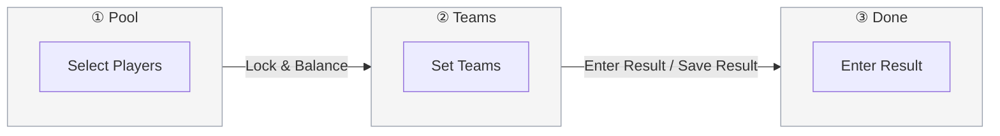

# Match Control Centre - State & Flow Diagrams

**Last Updated:** December 2, 2025  
**Status:** ✅ IMPLEMENTED  
**Related:** `SPEC_match-control-centre.md`

## Overview

This document contains Mermaid diagrams for the Match Control Centre flow, featuring:
- 3-step UI process (Pool → Teams → Done)
- 4 database states (Draft → PoolLocked → TeamsBalanced → Completed)
- Explicit save model for team changes (`teams_saved_at`)
- Player visibility gated on save status
- RSVP compatibility

---

## 1. Main State Machine

---

## 2. Admin Flow (Detailed)

---

## 3. Player View Logic

---

## 4. Data Model

---

## 5. Save Flow (Teams)

---

## 6. Edge Case Handling

---

## 7. RSVP Integration (Future)

```mermaid
flowchart TD
    subgraph RSVP["RSVP Flow"]
        R1[Admin creates match with RSVP] --> R2[Invitations sent to players]
        R2 --> R3[Players RSVP: Yes/No/Maybe]
        R3 --> R4{Pool complete?}
        R4 -->|No| R5[Wait for more RSVPs]
        R5 --> R3
        R4 -->|Yes| R6[Auto-balance triggered]
        R6 --> R7[Auto-save teams]
        R7 --> R8["teams_saved_at = NOW()<br/>Notify all players of teams"]
        R8 --> R9[Admin can still modify]
        R9 --> R10{Changes made?}
        R10 -->|Yes| R11[Save to update & re-notify affected]
        R10 -->|No| R12[Wait for match]
    end
    
    subgraph RSVPChange["RSVP Changes After Teams Set"]
        RC1[Player withdraws RSVP] --> RC2[Admin notified]
        RC2 --> RC3{Find replacement?}
        RC3 -->|Yes| RC4[Add to pool via Unlock]
        RC3 -->|No| RC5[Re-balance with fewer players]
        RC4 --> RC6[Re-lock & Re-balance]
        RC5 --> RC6
        RC6 --> RC7[Save & notify affected players]
    end
```

---

## 8. Stepper Visualization

**Step States by DB State:**
| DB State | Step 1 (Pool) | Step 2 (Teams) | Step 3 (Done) |
|----------|---------------|----------------|---------------|
| Draft | ⚫ Active (dark grey outline) | ○ Pending (light grey) | ○ Pending (light grey) |
| PoolLocked | ✓ Complete (light grey) | ⚫ Active (dark grey outline) | ○ Pending (light grey) |
| TeamsBalanced | ✓ Complete (light grey) | ✓ Complete (light grey) | ⚫ Active (dark grey outline) |
| Completed | ✓ Complete (light grey) | ✓ Complete (light grey) | ✓ Complete (light grey) |

**Styling Notes:**
- Neutral grey colours throughout (non-distracting)
- Active: Dark grey outline with dark grey number
- Completed: Light grey outline with grey checkmark
- Pending: Light grey outline with grey number
- No purple/pink gradient (reserve for CTAs)

---

## 9. Notification Matrix (Future)

| Event | Who Gets Notified | Message |
|-------|-------------------|---------|
| First Save | All players in match | "Teams for [date] are set! You're on [Team]" |
| Save after changes | Affected players only | "Your team has changed to [Team]" |
| Match reminder (24h) | All players | "Reminder: Match tomorrow at [time]. You're on [Team]" |
| Match completed | All players | "Match result: [Score]. [Winner] wins!" |
| RSVP invitation | Invited players | "You're invited to [date] match. RSVP now!" |
| RSVP deadline reminder | Non-responders | "RSVP deadline approaching for [date] match" |

---

## Summary

### Key Design Decisions

1. **4 DB States, 3 UI Steps**: 
   - DB: Draft → PoolLocked → TeamsBalanced → Completed
   - UI: Pool (1) → Teams (2) → Done (3)

2. **Explicit Save Model**: 
   - Lock & Balance creates team assignments in DB
   - `teams_saved_at = NULL` means players see "Teams being finalised..."
   - Admin clicks "Save Teams" to set `teams_saved_at = NOW()`
   - Players only see teams when `teams_saved_at` is set

3. **Working vs Saved**: 
   - Lock & Balance writes to DB (persisted on app close)
   - Drag/drop and Re-Balance update React state only (lost on app close)
   - "Save Teams" / "Save Changes" commits modifications to DB
   - "Discard" resets to last saved state

4. **Player Visibility**: Gated by `teams_saved_at` timestamp
   - NULL → "Teams being finalised..."
   - Set → Full team lists visible

5. **RSVP Compatibility**: 
   - Future: Auto-balance triggers auto-save (no manual action)
   - Notifications tied to save events

6. **Flexibility**: 
   - Admin can modify teams until match is completed
   - Clear save points with visual feedback (green flash)
   - No-show tracking with uneven team warnings

### Implementation Status ✅ COMPLETE

- [x] Add `teams_saved_at` column to `upcoming_matches`
- [x] Lock & Balance in single action with balance method modal
- [x] BalanceTeamsPane with local state tracking
- [x] Save Teams / Save Changes / Discard buttons
- [x] Green "✓ Saved!" flash feedback (1.5s)
- [x] Player view checks `teams_saved_at`
- [x] 3-step stepper with neutral grey styling
- [x] CompleteMatchForm with tap-to-toggle teams
- [x] No-show handling with uneven team warnings
- [x] Tornado charts for Ability/Performance only (not Random)

